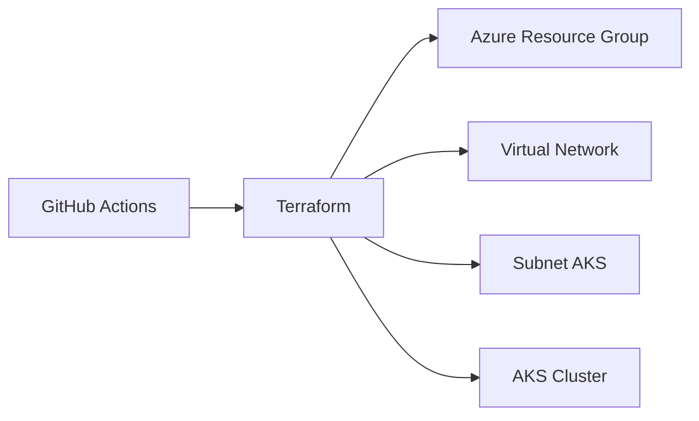

# Arquitetura Da Infraestrutura Kubernetes

```mermaid
flowchart LR
  GitHubActions[GitHub Actions] --> Terraform[Terraform]
  Terraform --> RG[Azure Resource Group]
  Terraform --> VNet[Virtual Network]
  Terraform --> Subnet[Subnet AKS]
  Terraform --> AKS[AKS Cluster]
```

## Escopo

- Provisionar o cluster Kubernetes.
- Provisionar VNet e subnet do cluster.
- Publicar outputs necessarios para integracao com a aplicacao.
